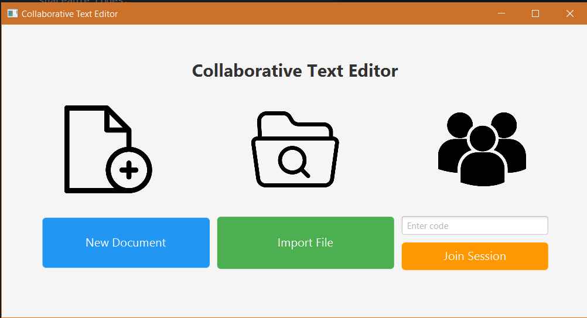
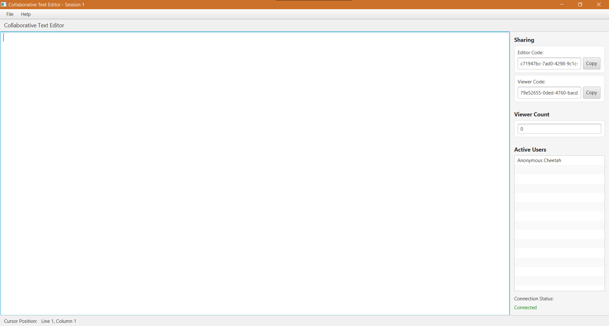
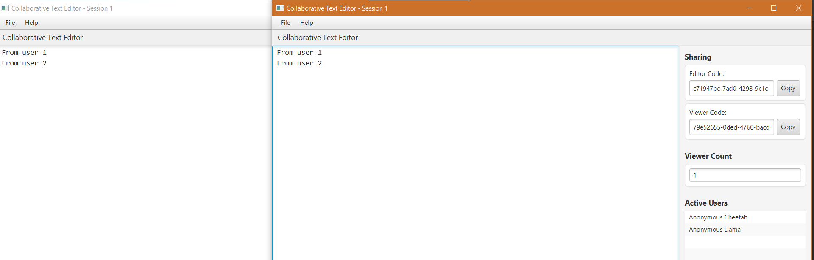
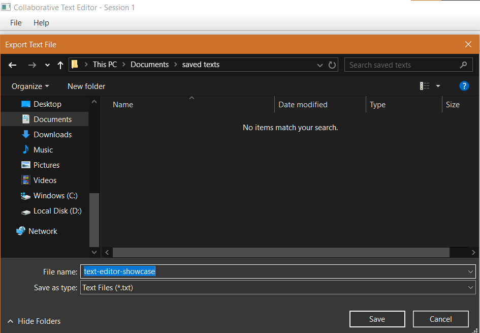

# Collaborative Plain Text Editor

A real-time collaborative plain text editor built in Java, designed for seamless document editing and sharing among multiple users. This project demonstrates advanced programming techniques, including real-time synchronization, CRDT-based conflict resolution, and user presence tracking.

---

## Table of Contents

- [Overview](#overview)
- [Features](#features)
- [Project Structure](#project-structure)
- [Built With](#built-with)
- [Prerequisites](#prerequisites)
- [Usage](#usage)
- [Screenshots](#screenshots)
- [Technical Details](#technical-details)
- [Contributing](#contributing)
- [License](#license)

---

## Overview

This application enables multiple users to collaboratively edit plain text documents in real time. Users can import/export .txt files, share documents via unique codes, and participate either as viewers or editors. The editor ensures consistency and conflict-free editing using a tree-based CRDT algorithm.

---

## Features

- **Real-Time Collaboration:** Multiple users can edit the same document simultaneously with instant updates.
- **Import/Export:** Import and export `.txt` files while preserving formatting and line breaks.
- **Shareable Codes:** Generate unique codes for each document—one for editors and one for read-only viewers.
- **Permission Handling:** Editors can modify documents; viewers have read-only access and cannot see shareable codes.
- **CRDT-Based Conflict Resolution:** Handles concurrent edits using a tree-based Conflict-free Replicated Data Type algorithm.
- **User Presence:** See a list of active collaborators in real time.
- **User-Friendly Interface:** Intuitive UI for editing, sharing, importing/exporting, and managing collaboration sessions.

---

## Screenshots

### 🏠 Main Menu



### 📝 Main Editor Interface



### 👥 Real-Time Collaboration



### 📂 Import/Export Menu




---

## 🛠️ Built With

[](https://www.oracle.com/java/)
[](https://spring.io/projects/spring-boot)
[](https://openjfx.io/)

---

## Prerequisites

- Java 17 (or a compatible version)
- Maven (for dependency and build management)
- Spring Boot (included via Maven)
- JavaFX SDK (for the client UI)
- IDE (e.g., IntelliJ IDEA or Eclipse)

---

## ▶️ Running the Project Locally (Detailed Guide)

### Recommended IDE: IntelliJ IDEA

We recommend using IntelliJ IDEA to run both the server and client projects easily.

### 🗂️ Project Structure

- **CollabTE_Server:** This folder contains the server.
- **APTUI:** This folder contains the client UI.

👉 Open each folder as a separate project in IntelliJ.

### 🖥️ Start the Server

1. Open the project in the `CollabTE_Server` folder.
2. Run the file `CollabTE_Server.java`.
3. Ensure the server is running at `ws://localhost:8081/ws` or your local IP.

### 💡 Set Up the Client to Connect to Your Local Server

1. Open the project in the `APTUI` folder.
2. Navigate to the file `NetworkController.java`.
3. Find this line:
   ```java
   String url = "http://192.168.1.45:8081/ws";
   ```
4. Replace the IP with your own **IPv4 address** (instructions below).
5. Keep :8081 this is the port not the ip address.


### ▶️ Run the Client

Inside the `APTUI` project, navigate to the 'ClientSide.java' File. It's inside the 'com.example.userclientfx.communication' package.

Run `ClientSide.java` to start a client session.

You can run as many clients as you want after starting the server.

### 🔍 How to Find Your IPv4 Address

**On Windows:**

```bash
ipconfig
```

Look under your active network adapter (e.g., "Wireless LAN adapter Wi-Fi") and find `IPv4 Address`.

**On macOS/Linux:**

```bash
ifconfig
# or
ip a
```

Look for your active interface (`en0`, `eth0`, or `wlan0`) and find the `inet` line.

---

⚠️ **This setup is for local testing only.**

---

## Technical Details

- **Language:** Java
- **Architecture:** Client-server model with central server for relaying edits
- **Synchronization:** Tree-based CRDT for conflict-free concurrent editing
- **UI Framework:** JavaFX
- **Networking:** WebSocket-based communication via Spring Boot

---